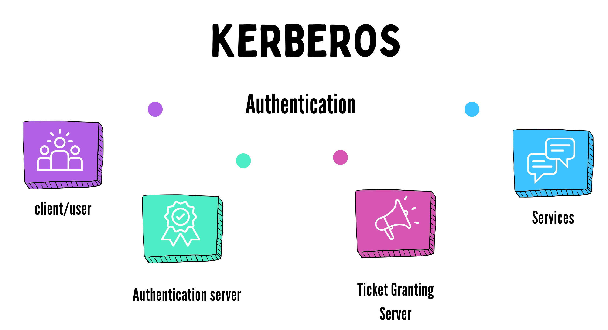

># Kerberos Authentication

# INTRODUCTION

*Kerberos, an authentication protocol, is a pivotal mechanism
for authenticating parties seeking access to specific services.
In digital environments, such as databases housing user information, ensuring the integrity of user identities is paramount.
Consider, for instance, a database containing records of video
game players alongside their associated details. In this scenario, it becomes imperative to ascertain that the accessing
entity is indeed the legitimate player and not an unauthorized
user attempting to gain entry into another player’s account.
Moreover, it is essential to maintain data integrity, ensuring
that individual player profiles remain distinct and unaltered.
Kerberos addresses these concerns by providing a robust authentication framework. By verifying the identity of users and
ensuring secure communication channels, Kerberos mitigates
the risk of unauthorized access and data manipulation.*

## II. AUTHENTICATION PROCESS IN KERBEROS

In the Kerberos realm, three entities play crucial roles:
the Client/User, the Key Distribution Center (KDC), and the
Services. The KDC comprises two components: the Authentication Server (AS) and the Ticket Granting Server (TGS).
Consider a user, Frey, who wishes to access a service, such
as a video game like League of Legends or Genshin Impact.
The authentication process unfolds as follows:

### A. Requesting a Ticket Granting Ticket (TGT)
Frey initiates the process by requesting a TGT from the
KDC. Upon authentication, the KDC issues a TGT to Frey,
which remains valid until its expiration or Frey’s logout,
eliminating the need for repeated authentication.

### B. Obtaining a Service Ticket (ST)
Frey submits the TGT along with additional data to the
KDC, requesting an ST for the desired service. The KDC
verifies Frey’s identity and issues an ST, which Frey can use
to access the service.

### C. Accessing the Service
Frey presents the ST to the service. The service validates
the ST to confirm Frey’s identity, but it does not determine
access rights at this stage. Instead, it relies on its authorization
mechanism to grant or deny access.

### D. Authorization Decision
Although Kerberos ensures the user’s identity, the service’s
authorization mechanism determines whether the user is permitted to access the requested service. For example, a user authenticated for one game may attempt to access another game’s service. While Kerberos confirms the user’s identity, the service’s server decides on access based on its policies.

### E. Handling Unauthorized Access
In the case of unauthorized access attempts, the service
server notifies the user accordingly, directing them to register
for access or providing alternative instructions.

*Kerberos' authentication provides a robust framework for
verifying user identities and facilitating secure access to
services. While it ensures the authenticity of users, it
leaves access control decisions to the service servers,
enabling flexible authorization policies tailored to specific
applications.*

## III. DEEPER DIVE INTO THE INTERACTION

**Client and Authentication Server Interaction**

In most systems, pre-authentication is enabled, allowing users to securely authenticate themselves with the system. The authentication process typically begins with the user’s request sent to the Key Distribution Center (KDC), which houses the Authentication Server (AS). This initial message includes various pieces of information, notably the current timestamp, serving to prevent replay attacks. Subsequently, the authentication server responds by issuing a Ticket Granting Ticket (TGT) along with a session key.

### A. Client and Authentication Server Interaction

The user initiates the authentication process by composing a message containing their username/ID, the service name or ID they intend to access, their IP address, and the timestamp. This message is then forwarded to the authentication server for processing.

The authentication server, being a crucial component of the KDC, maintains a database of user identities alongside their corresponding secret keys. Upon receiving the user’s request, the authentication server verifies the provided credentials against its database.

Following this verification, the authentication server constructs two messages. The first message includes the name of the Ticket Granting Service (TGS), the timestamp of its creation (to mitigate replay attacks), and the lifetime of the TGT, which aligns with the TGT’s lifetime.

In the Ticket Granting Ticket (TGT) phase, crucial information including the user’s username, Ticket Granting Service (TGS) name, timestamp of TGT creation, user IP address, and the ticket’s lifetime are encapsulated. While providing a ticket with lifetime access may seem convenient from a client’s perspective, it poses security risks, hence the inclusion of a limited lifetime.

But wait, there’s more. Next, a TGS session key is appended to both packets. The first packet is encrypted with the client’s secret key, while the second packet containing the TGT is encrypted with the TGS secret key. This encryption ensures the security of the packets during transmission over the internet. Even in the event of a hacker intercepting these packets, they would lack the client’s secret key necessary for decrypting the first packet and the TGS secret key required for decrypting the TGT. Therefore, sharing these packets over the internet remains secure.

### B. User to Ticket Granting Server Interaction

Upon receiving the encrypted messages from the Ticket Granting Server (TGS), the user begins the decryption process. The user’s secret key, derived from their password combined with salt and a key version number, is used to decrypt the first message.

Upon successful decryption, the user obtains the TGS name and TGS session key. However, the user cannot decrypt the second message containing the Ticket Granting Ticket (TGT) as they lack the TGT secret key.

Subsequently, the user generates two new messages: one containing the service name and ticket lifetime, and the other containing the username and timestamp. These messages are encrypted with the TGS session key and sent back to the Ticket Granting Server along with the TGT.

The Ticket Granting Server verifies the unencrypted message to identify the requested service. Upon locating the service in its database, the TGS decrypts the TGT using its secret key and retrieves the TGS session key. With this key, the TGS decrypts the user authentication message.

After decryption, the TGS performs several checks:

- It verifies that the username in the TGT matches the one in the authentication message to confirm user authentication.
- It compares the timestamps to ensure message freshness.
- It checks the user’s IP address to prevent session hijacking.
- It validates the TGT lifetime to ensure it’s not expired.

Additionally, the TGS checks its cache to prevent replay attacks by confirming if the user is already authenticated.

Next, the TGS generates two messages:

- One message includes the service name, timestamp, lifetime, and a service session key encrypted with the TGS session key.
- The other message is a Service Ticket containing the username, service name, timestamp, user IP address, lifetime, and the service session key.

Once prepared, these messages are sent back to the user, completing the interaction.

### C. User and Service Interaction

Upon receiving the two tickets, the user can open the first ticket with the TGS session key obtained from the authentication server. This ticket contains crucial information such as the service name, timestamp, lifetime, and the service session key. With this information, the user can create a message containing their username and timestamp, encrypt it with the service session key, and send both the message and the service ticket to the service server.

The service server receives the two messages and begins by opening the Service Ticket using the service ticket’s secret key. Subsequently, the user authentication message is decrypted using the service session key obtained from the service ticket.

Now that both messages are decrypted, several checks are performed.

Firstly, the usernames in the two messages are compared to ensure they belong to the same person. Then, the timestamps of when the messages were created are verified for freshness. Additionally, the user’s IP address and the message’s IP address are compared to ensure they match. Finally, the lifetime of the ticket is checked for validity.

If all checks pass, the service server checks its cache to determine if the user is already verified and using the service for the first time. If it’s the user’s first time accessing the service, a service authentication message is created. This message includes the service name and timestamp, encrypted with the service session key, and sent back to the user.

### D. Client Interaction

Upon receiving the message, the client verifies its authenticity by decrypting it using the session key received from the Ticket Granting Server (TGS). It ensures that the service name and timestamp are valid and consistent with the expected values. This verification process helps to confirm the integrity of the message and ensures that it has not been tampered with during transmission.

After verifying the message, the client checks its cache to determine if it already has information about the service. If the cache is empty, indicating that the client has not interacted with this service before, it adds the relevant information to its cache. This information may include details about the service, such as its name and associated session key, which can be used for future interactions.
